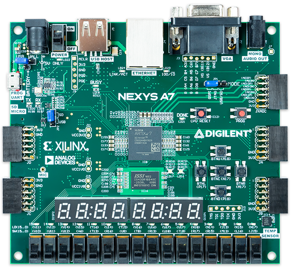

# VHDL project - PWM Based Tone Generator

### Team members

* Knap Denis
* Molák Dominik
* Lysá Barbora

## Theoretical description and explanation

Our main objective was to develop a tone generator using PWM on the audio jack connector of the Nexys A7 FPGA board to produce simple musical tones or melodies. 
Users are able to adjust parameters such as frequency and duration using switches on the Nexys A7-50T board. LEDs offer visual indication of the currently generated tone.

We decided to generate the chromatic scale form C5 to C6, separate tone A4 and the frequency of 1kHz. With this, users can play any melodies they would like and use our board as a musical instrument. 

## Hardware description of demo application
By using switches (SW[0] to SW[15]) embeded on the Nexys A7-50T board, users can generate required tones. LEDs above switches (LED[0] to LED[15]) 
indicate which switch was switched on and what tone is playing. 
For output we are using the mono audio out jack and pins A11 and D12 which represent output for PWM Audio Amplifier. 

Description of switches and notes assigned to them:
| **Switch** | **LED** | **Note** | **Frequency** |
| :---: | :---: | :---: | :---: |
| SW[0] | LED[0] | A4 | 440 Hz |
| SW[1] | LED[1] | - | 1 kHz |
| SW[2] | LED[2] | - | - |
| SW[3] | LED[3] | C6 | 1045.5 Hz |
| SW[4] | LED[4] | B5 | 987.77 Hz |
| SW[5] | LED[5] | A#5 | 932.33 Hz |
| SW[6] | LED[6] | A5 | 880 Hz |
| SW[7] | LED[7] | G#5 | 830.61 Hz |
| SW[8] | LED[8] | G5 | 789.99 Hz |
| SW[9] | LED[9] | F#5 | 739.99 Hz |
| SW[10] | LED[10] | F5 | 698.46 Hz |
| SW[11] | LED[11] | E5 | 659.26 Hz |
| SW[12] | LED[12] | D#5 | 622.25 Hz |
| SW[13] | LED[13] | D5 | 587.33 Hz |
| SW[14] | LED[14] | C#5 | 554.37 Hz |
| SW[15] | LED[15] | C5 | 523.25 Hz |

## Software description
For the software part of the project, we used simple_counter source code form laboratory excercises and a PWM_Based_Tone_Genreator. 

The role of the simple counter is to count half periods and full periods of the signal which are then sorted in the pwm base tone generator code by if and else functions. 
PWM base tone generator code regulates how many half periods and full periods will be played with each switch, which determines what kind of frequency will be on the output.     

In the top_level source code we connected these two codes together and assigned each input to the right output for full funcionality. The finalised schematic is visualised here:  

[Link to source files](projekt_finalna_verze/PWM_Based_Tone_Generator.srcs) 

### Components simulation

Behavioral simulation showcasing the state when the first switch is turned on:

## Instructions
As already mentioned, operating the board is easy. By simply turning the switches on and off users can produce notes, tones and molodies according to their own preferences.

[Demonstration video schowcasing funcionality of the board](https://youtube.com/shorts/lQLAUqp4Dtc?si=swuIUwftOgwQgKO7)

## References

1. [Nexys A7 Reference Manual](https://digilent.com/reference/programmable-logic/nexys-a7/reference-manual)
2. [GitHub Repository For The Course](https://github.com/tomas-fryza/vhdl-course/tree/master)
3. [Youtube Video - VHDL Code For 1Hz Frequency Generator](https://www.youtube.com/watch?v=IaEMLoEjr0s)